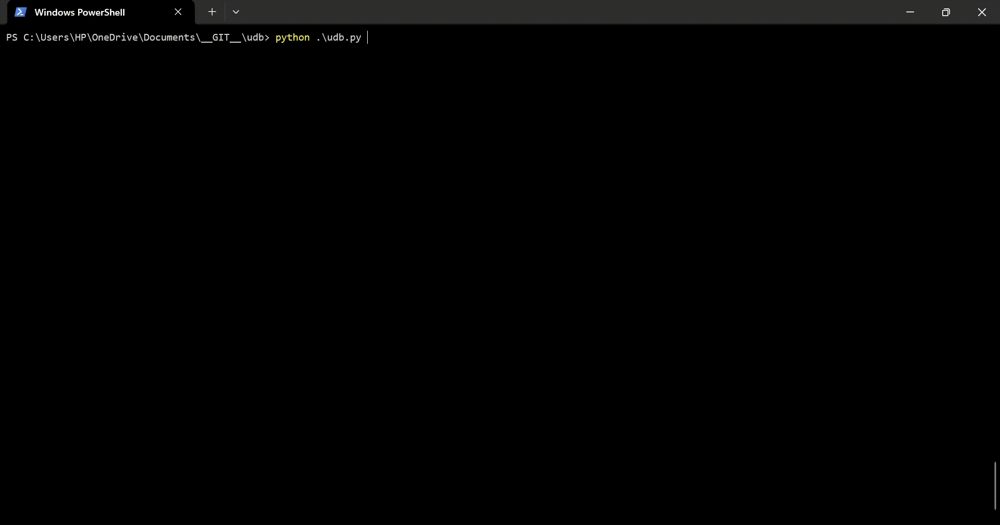

# UDB [Ultimate-Download-Bot]

Welcome to the UDB, the Ultimate-Download-Bot for Anime, Drama, Movies & TV Shows! 🎉

## Current Status (as on 2024-10-08)
| S.No | Category           | Website                                   | Status |
| :--: | :----------------- | :---------------------------------------: | :----: |
|   1  | Anime              | [GogoAnime](https://anitaku.to/)          | Active (But no updates after Nov' 24, 2024) |
|   2  | Anime              | [AnimePahe](https://animepahe.ru/)        | Active |
|   3  | Drama              | [MyAsianTV](https://myasiantv.ac/)        | Inactive |
|   4  | Drama              | [Asianbxkiun](https://asianbxkiun.pro/)   | Active (But no updates after Nov' 24, 2024) |
|   5  | Movies & TV Shows  | [Vidsrc](https://vidsrc.to/)              | Support discontinued |
|   6  | Movies & TV Shows  | [Superembed](https://streambucket.net/)   | Support discontinued |
|   7  | Anime, Drama, Movies & TV Shows | [KissKh](https://kisskh.co/) | Active (But no multi-resolutions) |

## Insipiration

It is a weekend and you found a good anime/series to binge-watch. But the effort of downloading all episodes (especially for series like One Piece 😅), the pain is unimaginable. _Ofcourse, you have an option to watch online, but what about people with poor unstable networks, or students with limited access to wifi_. So, this is created to help all such troubled souls. As Ikta Solorok once said: `Laziness is the mother of evolution`

## Overview

The UDB is a fantastic tool designed for all the anime, drama, series lovers out there. With just a few clicks in the command line, you can effortlessly download entire series, saving you the hassle of manually downloading each episode one by one.



## Features

- **Batch Download:** Download complete anime series or drama shows or TV shows with a single command.
- **Fast and Efficient:** The downloader is optimized for speed, allowing you to grab your favorite episodes in no time.
- **Customizable Options:** Choose specific seasons, episodes, or ranges to download according to your preferences.
- **Quality Selection:** Select the video quality that suits your needs.
- **Auto-Retry:** If a download fails, the downloader automatically retries until successful.
- **Informative Progress Bar:** Track the progress of your downloads with a visually appealing progress bar.
- **Command Line Interface (CLI) Automation:** UDB provides robust support for CLI arguments, facilitating seamless automation of tasks.
- **High-speed Downloader:** Optimized to offer best download experience.
- **Ad-Free Experience:** UDB offers an ad-free downloading experience, ensuring uninterrupted access to your favorite anime, drama, movies, and TV series without any distractions.

## Supported OS
- Windows
- Linux
- Android (Termux only)

## Requirements

To use the UDB, make sure you have the following requirements met:

- Python 3.8 or higher
- pip
- Internet connection
- ffmpeg
  - Windows:
    - download ffmpeg from [here](https://ffmpeg.org/download.html)
    - add to Environment variables > PATH
  - Linux (Ubuntu):
    - sudo apt install -y ffmpeg
  - Android (Termux):
    - pkg install ffmpeg

## Installation

1. Clone the repository:

    ```
    git clone https://github.com/Prudhvi-pln/udb.git
    ```

2. Navigate to the project directory:

    ```
    cd udb
    ```

3. Install the required dependencies:

    ```
    pip install -r requirements.txt
    ```
4. Edit the configuration in your favourite editor: __Make sure to set the download path__

    ```
    vi config_udb.yaml
    ```

5. You're all set! Start downloading your favorite series by running:

    ```
    python udb.py
    ```

## Usage

UDB is super easy to use. Follow these steps:

1. Launch your favorite command-line interface.
2. Navigate to the project directory.
3. Run the following command:

   ```
   python udb.py
   ```

4. Sit back, relax, and let the magic happen! The downloader will guide you through the process and download your selected series/movie.

5. Run `python udb.py -h` for more information about the cli arguments

## Contributing

I welcome contributions from fellow anime and drama enthusiasts like you! If you have any ideas, improvements, or bug fixes, feel free to open an issue or submit a pull request. Let's make this downloader even more amazing together!

## Acknowledgements

I would like to express my gratitude to the creators and developers of the open-source libraries and tools used in this project. Without their contributions, this downloader would not be possible.
 - [animdl](https://github.com/justfoolingaround/animdl)
 - [dra-cla](https://github.com/CoolnsX/dra-cla/blob/main/dra-cla)
 - [vidsrc-to-resolver](https://github.com/Ciarands/vidsrc-to-resolver)
 - [vidplay-keys](https://github.com/KillerDogeEmpire/vidplay-keys)
 - [m3u8downloader](https://github.com/josephcappadona/m3u8downloader)

## Known issues
 - Progress bar printing duplicate lines for same file
   - This issue occurs due to ascii characters used and depends on the command line (Prefer Powershell in Windows)

---

Start binge-watching your favorite movies / series like never before! Happy downloading! 🍿✨
